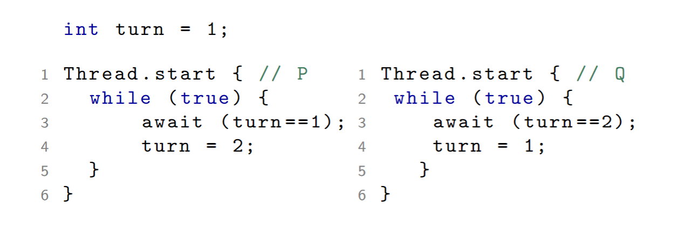
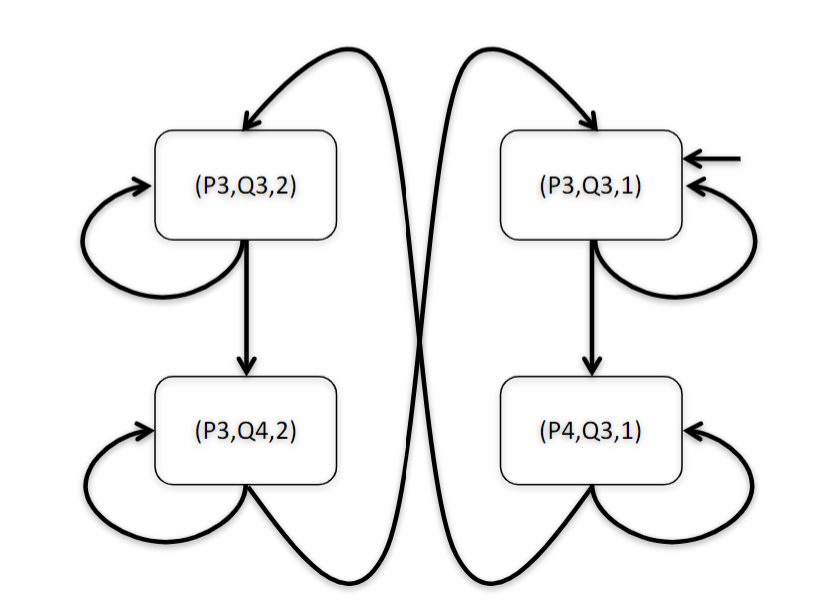
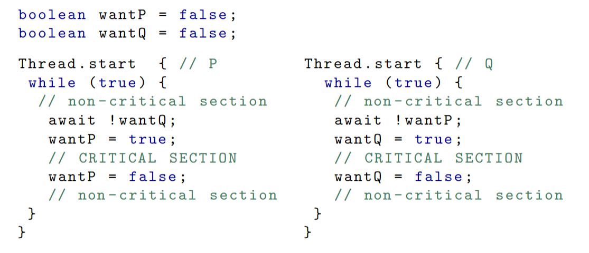
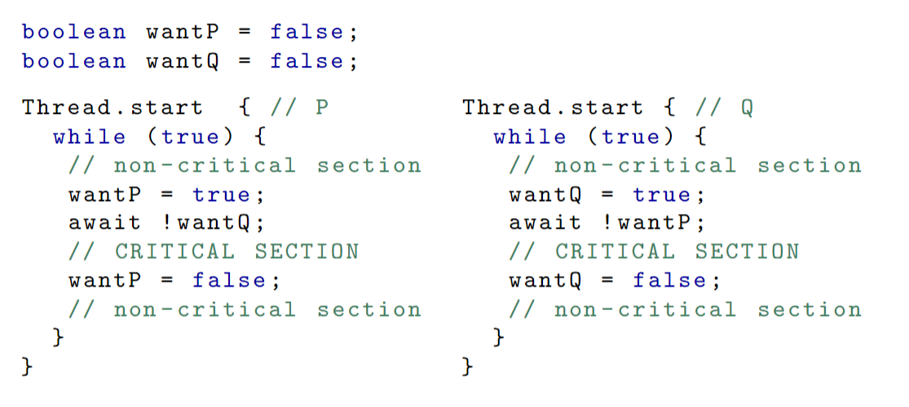
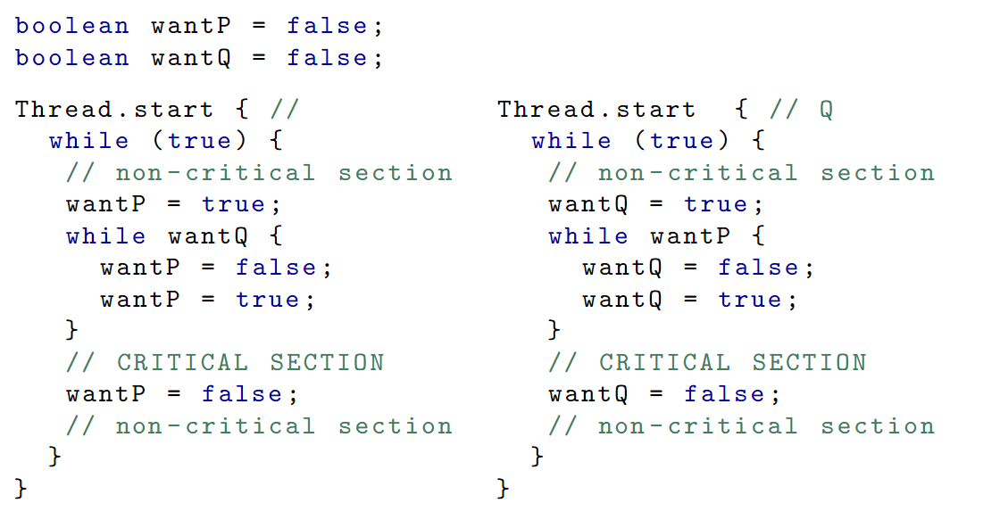
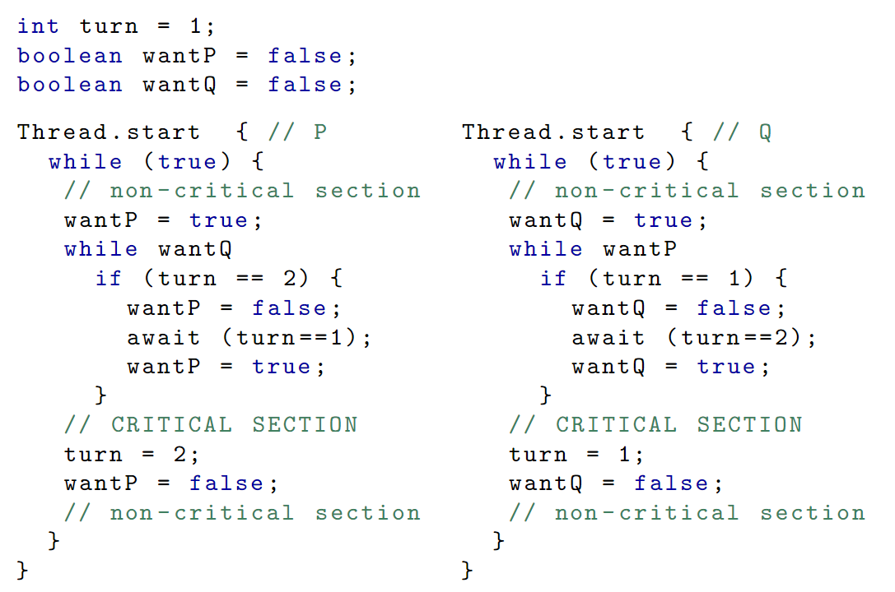
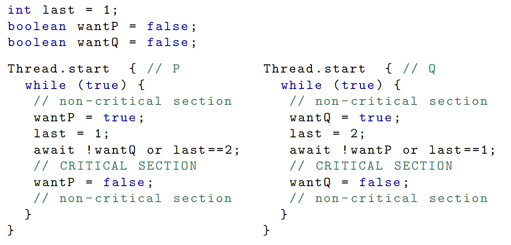

# Mutual Exclusion

## Atomicity Assumption on Statements

An instruction such as `x = x+1` is actually compiled into simpler sets of assembly instructions. This could cause undesired interleavings at the assembly level. 

> **Atomic Operation**
>
> An operation is atomic if it cannot be interleaved at a lower level ofabstraction.

- Atomic operations are the smallest units in terms of which a path can be constituted
- In order to reason about concurrency at the `source` level, we need to know what is assumed atomic at the `source` level
  - We assume throughout this course that all (single-line) statements are atomic
  - In particular, assignments such as `counter = counter+1` are assumed to be atomic

We occasionally simulate lack of atomicity of assignment (atthe source level) by decomposing it into several simpleinstructions.

For example:
```java 
counter = counter +1;
```
can be decomposed into:
```java
temp = counter +1;
counter = temp;
```

> An occurrence of variable `v` in `P` is a critical reference if
> 1.  it is assigned in `P` and occurs in another process `Q`, or
> 2.  it is read in `P` and is assigned in another process `Q`.
> 
> A program satisfies the `Limited Critical Reference (LCR)` property if every statement contains **at most one** critical reference
> 
> Concurrent programs that satisfy the LCR restriction yield the same set of behaviors whether the statements are considered atomic or are compiled to a machine architecture with atomic load and store.
> 
> Attempting to present programs that satisfy the LCR restriction is thus convenient

## Race Condition

Once thread `T1` starts doing something, it needs to *“race”* to finish it because if thread `T2` looks at the shared variablebefore `T1` is done, it may see something inconsistent

> **Race Condition**
>
> Arises  if  two  or  more  threads  access  the  same  variables  or  objects concurrently and at least one does updates

This is hard to detect and there can be race conditions in programs that satisfy LCR.

## Critical Section


> **Critical Section**
>
> A  part  of  the  program  that  accesses  shared  memory  and  which  wewish to execute atomically

```java
Thread.start { 
  while(true) {
    // non-critical  section
    entry  to  critical  section;
    //  CRITICAL  SECTION
    exit  from  critical  section;
    // non -critical  section
  }
}
```

> **The Mutual Exclusion Problem**
> 
> 1.  `Mutex`:  At any point in time, there is at most one thread inthe critical section
> 2.  `Absence of livelock`:  If various threads try to enter the criticalsection, at least one of them will succeed
> 3.  `Free from starvation`:  A thread trying to enter its criticalsection will eventually be able to do so

### Reasonable Assumptions of MEP

- There are no shared variables between the critical section andthe non critical section (nor with the entry/exit protocol).
- The critical section always terminates.
- The **scheduler** is **fair** (a process that is waiting to run, will be able to do so eventually)

## General Scheme to Address the MEP


```java 
while (cond) { }; // is called a busy-wait loop

while (cond) {} → await !cond
```

We will assume that `await` is atomic, for this an all subsequent programs. For most of our examples this makes no difference since it satisfies the LCR property.

### Attempt I

> 


Can gaurentee MEP holds because there will never be a state `(P4, Q4, ?)` in the transition system. This also enjoys absence of livelock, but not freedom from starvation. 

### Attempt I: Transition System

> 

This is becasue if thread P goes into an infinite loop/throws an exception it will never complete and set the value of turn to 2 causeing thread Q to never run.

### Attempt II

> 

In this case, mutual exclusion does not hold since both threads can enter the critical section.

### Attempt III

> 

This solution enjoys mutual exclusion and freedom from starvation, however it does not avoid livelock.

> **Contention**
>
> - **Naive back-out**: either back out if they discover they are contending with the other
> - **Dekker’s algorithm**: take turns
> - **Peterson’s algorithm**: give priority to the first one that wanted access

### Attempt IV - Naive back-out
 
> 

This solution enjoys mutual exclusion and absence of livelock however, it is not free from starvation since there is an interleaving where P can enter and exit the critical section but Q will repeatedly try and fail. 

### Dekker's algorithm (1965) - Combines attempts I & IV
 
`Right to insist on entering` is passed between the two processes.

> 


### Peterson's algorithm - (1981)

Similar to Dekker except that if both want access, priority is givento the first one that wanted to access.
 
> 
