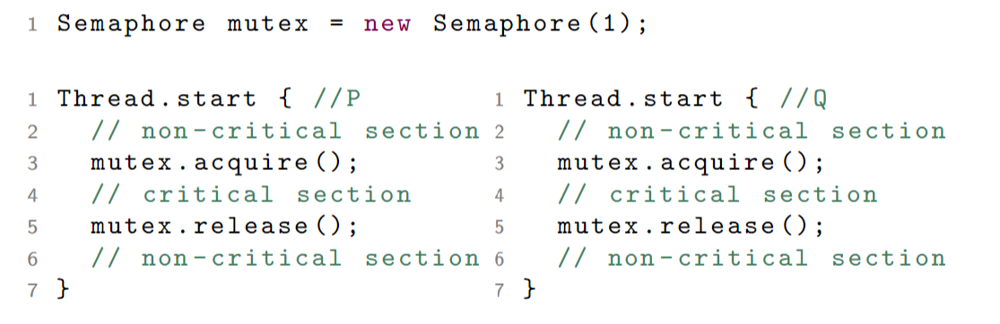

# Sepaphores I


## States of a process

- **Inactive**: 
- **Ready**: Code is not running but it is places in a 'queue' of ready processes. From here the scheduler chooses code and runs it.
- **Running**: Code is being executed.
- **Completed**: Execution is finished.
- **Blocked**: A process needs access to some resource that is not currently available.

> 

## What is a semaphore?

A sepaphore is an Abstract Data Type with:
- Atomic operations: 
  - aquire (or wait)
  - release (or signal)
- Data fields:
  - permissions: non-negative integer
  - processes: a set of processes

### Aquire

> 

### Release

> 

## Mutual Exclusion Using Semaphores

The MEP for two processes becomes trivial if we use a `mutex`. 

- Entry protocol: `mutex.aquire();`
- Exit protocol: `mutex.release();`

> 

This solution does not use busy waiting: a process that blocks in the acquire goes into the `BLOCKED` state and only returns to the `READY` state once it is given permission to do so.


## Semaphores in Java

Class `Semaphore` in `java.util.concurrent`

> ```java
> import java.util.concurrent.Semaphore;
> ```

```java
/** Creates a semaphore with the given number of permits */
Semaphore(int permits)

/** Acquires a permit from this Semaphore, blocking until  one is available */
void acquire()

/** Releases a permit, returning it to the semaphore */
void release()
```

> **Example**
> 
> ```java
> Semaphore mutex = new Semaphore(1);
> mutex.aquire();
> // Critical section
> mutex.release();
> ```

## Semaphore Invariants

Let `k` be the initial value of the `permissions` field of a semaphore `s`

1. permissions ≥ 0
2. permissions = k + #releases − #acquires

where:
- `#releases` is the number of `s.release()` statements executed 
- `#acquire` is the number of `s.acquire()` statements executed 
- A blocked process is considered not to have executed an acquire operation.