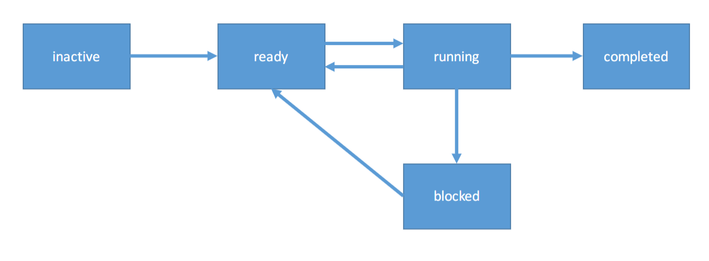
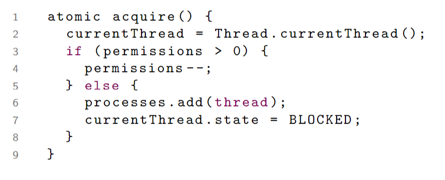
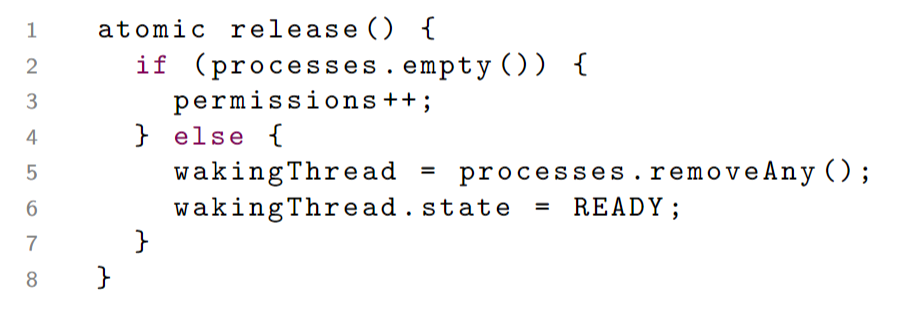
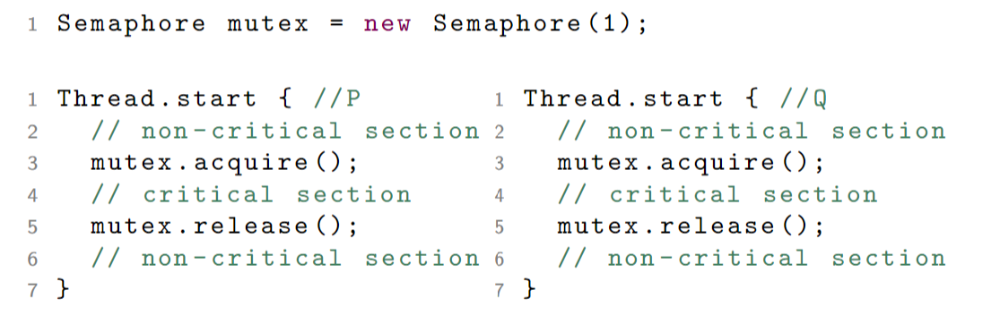

# Sepaphores I

## States of a process

- **Inactive**: 
- **Ready**: Code is not running but it is places in a 'queue' of ready processes. From here the scheduler chooses code and runs it.
- **Running**: Code is being executed.
- **Completed**: Execution is finished.
- **Blocked**: A process needs access to some resource that is not currently available.

> 

## What is a semaphore?

A sepaphore is an Abstract Data Type with:
- Atomic operations: 
  - aquire (or wait)
  - release (or signal)
- Data fields:
  - permissions: non-negative integer
  - processes: a set of processes

### Aquire

> 

### Release

> 

## Mutual Exclusion Using Semaphores

The MEP for two processes becomes trivial if we use a `mutex`. 

- Entry protocol: `mutex.aquire();`
- Exit protocol: `mutex.release();`

> 

This solution does not use busy waiting: a process that blocks in the acquire goes into the `BLOCKED` state and only returns to the `READY` state once it is given permission to do so.

