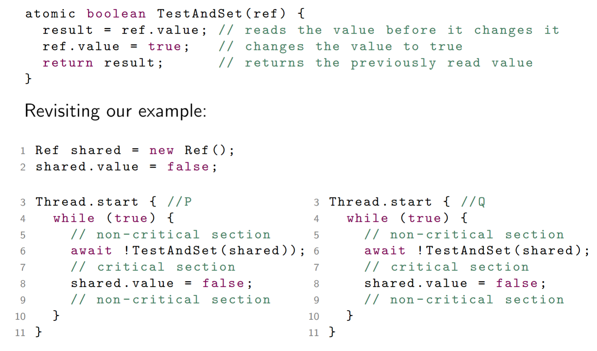

# Complex Atomic Options

Solving the MEP using atomic load and store is not an easy problem to solve. This difficulty disappears if we allow more complicated atomic operations.

> Also known as `read-modify-write (RMW)` operations.

Specific atomic operations are provided by hardware to allow a fixed number of instructions to be executed atomically.

## Test and Set

> 

