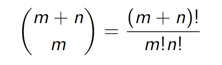

# Introduction to Concurrent Programming

The study of systems of interacting computer programs whichshare resources and run concurrently (i.e. at the same time). Concurrency, and hence process synchronization, is useful onlywhen processes interact with each other

**Parallelism**: Occurring *physically* at the same time

**Concurrency**: Occurring *logically* at the same time, but could be implemented without real parallelism

## Competative Processes

**Deadlock**: each thread takes a resource and waits indefinitely until the other one has freed that recource.

**Livelock**: each thread takes a resource, sees that the other thread has the other resource and returns it (this repeats indefinitely).

**Starvation**: one of the threads always takes the resources before the other one.

> Communication mechanisms are necessary for cooperation tobe possible.

## Modeling Program Execution

Number of interleavings is exponential in the number ofinstructions. If *P* has *m* instructions and *Q* has *n* instructions, then there are

> 

A **Transition System** *A* is a tuple (*S*, &#8594;, *I*) where *S* is the set of states, &#8594; &#8838; *S* x *S* is a transition relation, and *I* &#8838; is the set of initial states. 

> *A* is said to be finite if *S* is finite. 

> We write s &#8594; s' for (s, s') &#8712; &#8594;
